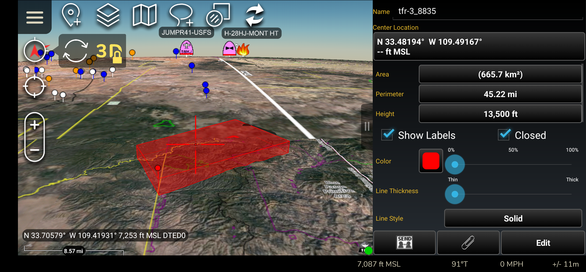
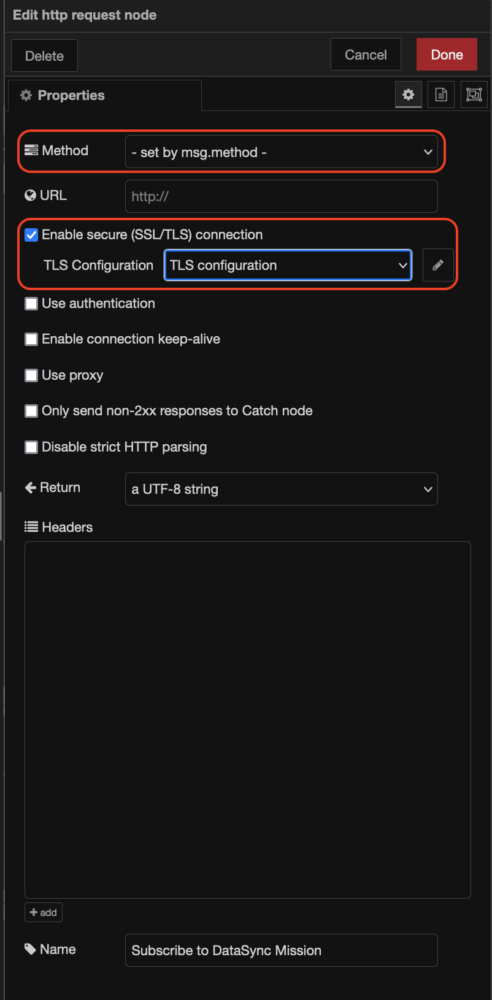

# node-red-contrib-tfr2cot
Requests TFR List for a given state from https://tfr.faa.gov/ and creates cursor-on-target (CoT) polygon messages sent to a Team Awareness Kit (TAK) Server or network

**ATAK Screenshots**

**FAA Website from url in `Associated Link` field in the TFR / CoT information menu:**

## SUMMARY

This Node RED subflow pulls a list of current Federal Aviation Administration (FAA) [Temporary Flight Restrictions (TFRs)](https://tfr.faa.gov/), and if any exist for the desired / supplied state, it downloads the xml file for each TFR and creates a [Team Awareness Kit](https://tak.gov) cursor-on-target (CoT) polygon message and sends it to a TAK Server or TAK network using [node-red-contrib-tak](https://github.com/snstac/node-red-contrib-tak) and `tcp out` nodes:

### Pre-Requisite
1. Node RED installed and continuously running (See Greg Albrecht's [video](https://youtu.be/1mHphHhX4lk) on how to install Node-Red on Windows.
2. TAK Network, TAK Server, or WinTAK EUD if running Node-RED on windows.
   
### If using a TAK Server (Optional)
1. An open port on your TAK Server using an `x509` authorization if you plan to use tls (most secure)
2. A certificates generated by the TAK Server and the TCP node ([See Greg Albrect's video](https://youtu.be/5i-y3Nc01Hs)) or [here]([https://node-red-contrib-tak.readthedocs.io/en/latest/](https://node-red-contrib-tak.readthedocs.io/en/latest/tls/))

### If sending to DataSync (Optional)
1. You must use the `dataSyncSubscription` node with all fields either completed (except for recipientID) and/or configure use the correct `missionApiPort` for your TAK Server *(default is `8442`)*
2. You must add a `http request` nodes to output #2 for both the `dataSyncSubscription` and `tfr2cot` nodes and **ONLY** configure the following node properties:
   - `Method`: select " - set by msg.method"
   - Check `Enable secure (SSL/TLS) connection`, and use exactly the same `tls` configuration you created or use for your `tcp Out` node that directly follows your `node-red-contrib-tak` node output.
3. The `properties` for the `tfr2cot` and `dataSyncSubscription` nodes must match *(i.e. be identical where they are common to both nodes)*
   
**Example `tfr2cot` / `dataSyncSubscribe` nodes diagram:**

**Example `http request` node configuration:**

## LIMITATIONS AND SPECIAL CONSIDERATIONS:
1. TFRs with multiple areas may only pick one area.  Future updates will correct this.
2. **DATASYNC CONSIDERATIONS**:
   - Leaving the `Save to DataSync` property in the <code>tfr2cot</code> node ***unchecked*** with `DataSync / TAK Mission`, `Sender ID`, `TAK Server URL`, `TAK Server API Port` configured correctly will allow TAK clients / Users that are connected to the TAK Server and currently subscribed to the DataSync mission listed in the `DataSync / TAK Mission`property to receive the CoT messages, however, the CoT messages will ***NOT*** be saved to the DataSync Mission.
   - If the `Save to DataSync` property in the <code>tfr2cot</code> node is ***checked*** with the other properties correctly filled in, the CoT Message ***will be saved*** to the DataSync mission
  
   > **NOTE:** Saving the CoT messages to DataSync may present some challenges:
   1. The CoT message will currently not be removed when the TFR is no longer active, which will require someone to manually delete old/stale TFRs from the DataSync mission.  Future updates may include a TFR check and send an `http put` message via the TAK Server Mission API to remove TFRs no longer listed at the FAA TFR [website](https://tfr.faa.gov).
   2. Updates and changes over time to the DataSync mission will create a log that may be significantly large and present performance issues.

> It is recommended to either:
   1. set your `TCP Out` node to stream to a port created on a TAK Server with an `stcp` protocol and with `filtergroup`(s) set to that port to create a TAK `Channel`, and users may access the feed if by setting the `Out` Group in the TAK Server's `Administrative` -> `Manage Users` page, OR
   2. Stream to a port created on a TAK Server with an `stcp` protocol with the DataSync-related properties in the `tfr2cot` and `dataSyncSubscribe` nodes correctly configured with the `Save to DataSync` property in the `tfr2cot` node left ***UNCHECKED***.
> Either option will require modifying your TAK Server's `/opt/tak/CoreConfig.xml` file to create an `stcp` port with or without a <filtergroup> tag.

## REQUIRED NODES
1. **INJECT:**  The `msg.payload` should be set to a US state abbreviation (e.g. AZ, CA, NY, etc).
2. [**node-red-contrib-tak:**](https://node-red-contrib-tak.readthedocs.io/en/latest/tls/)  This node is required to pass the CoT message from this subflow to a TAK Server or EUDs on a network. 
3. **TCP OUT:** 
   - **TAK Server:** If using TLS, check on the SSL / TLS option and create or edit your TLS Configuration, as needed.
   - **UDP:** This would need to be configured to your vpn settings and requires your Node Red instance to be on the same vpn to multicast to TAK end-user-devices.
4. **dataSyncSubscription:** (only if sending the CoT messages to a DataSync mission is desired).

For more information on how to set up the network and [node-red-contrib-tak](https://node-red-contrib-tak.readthedocs.io/en/latest/) nodes, see https://node-red-contrib-tak.readthedocs.io/en/latest/

## INSTALLATION:
1. Import -> Paste the `./examples/node-red-contrib-tfr2cot_subflow.json` file into to Node-RED into the import dialog.
2. Install using `npm`:  `npm i node-red-contrib-tfr2cot`
3. Install in Node-RED admin site using the `Manage Palette` menu option, click on the `Install` tab, and search for `node-red-contrib-tfr2cot` in the search field, then click on the "Install" button.

## License & Copyright

Copyright 2023 CLP Development, LLC

Licensed under the Apache License, Version 2.0 (the "License"); you may not use this file except in compliance with the License. You may obtain a copy of the License at:

http://www.apache.org/licenses/LICENSE-2.0

Unless required by applicable law or agreed to in writing, software distributed under the License is distributed on an "AS IS" BASIS, WITHOUT WARRANTIES OR CONDITIONS OF ANY KIND, either express or implied. See the License for the specific language governing permissions and limitations under the License.
